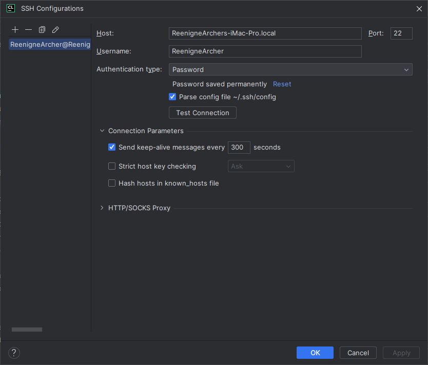
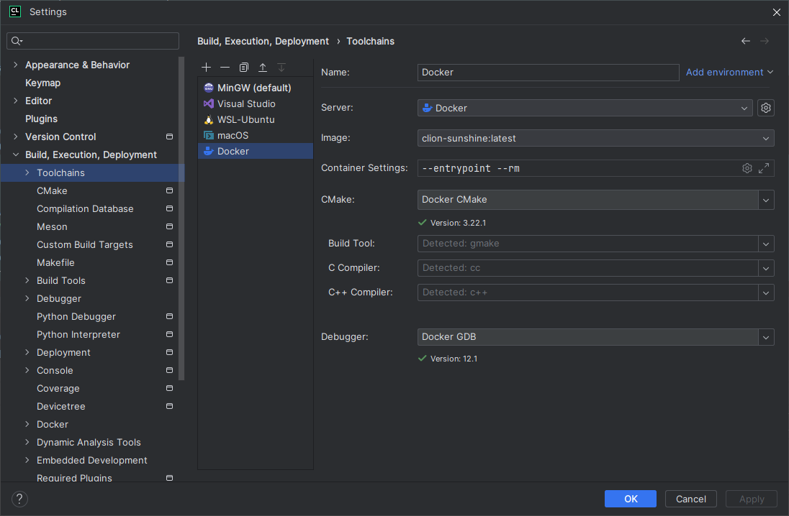
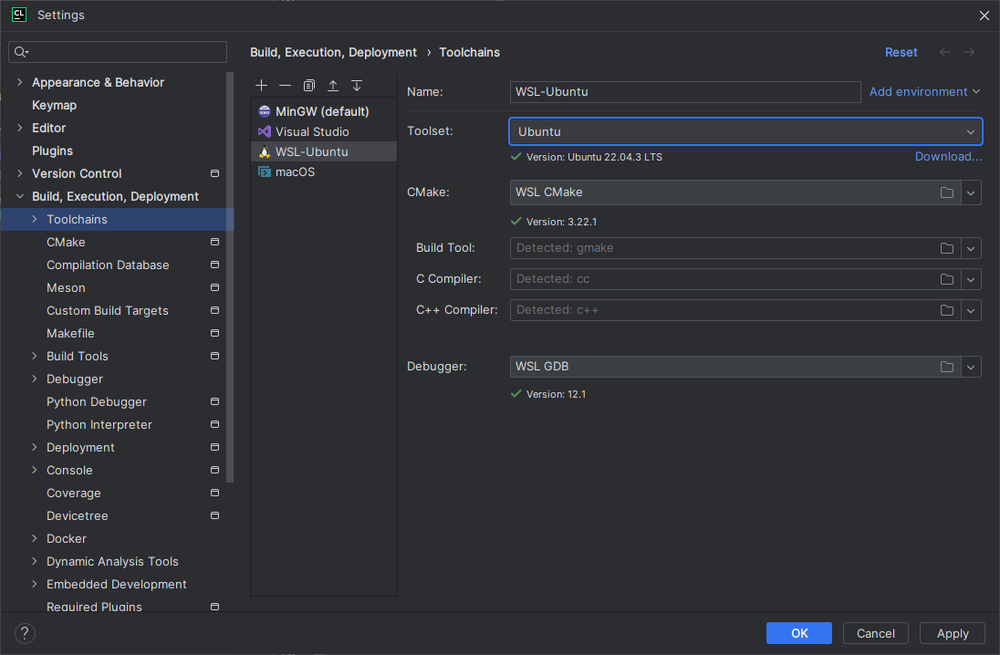
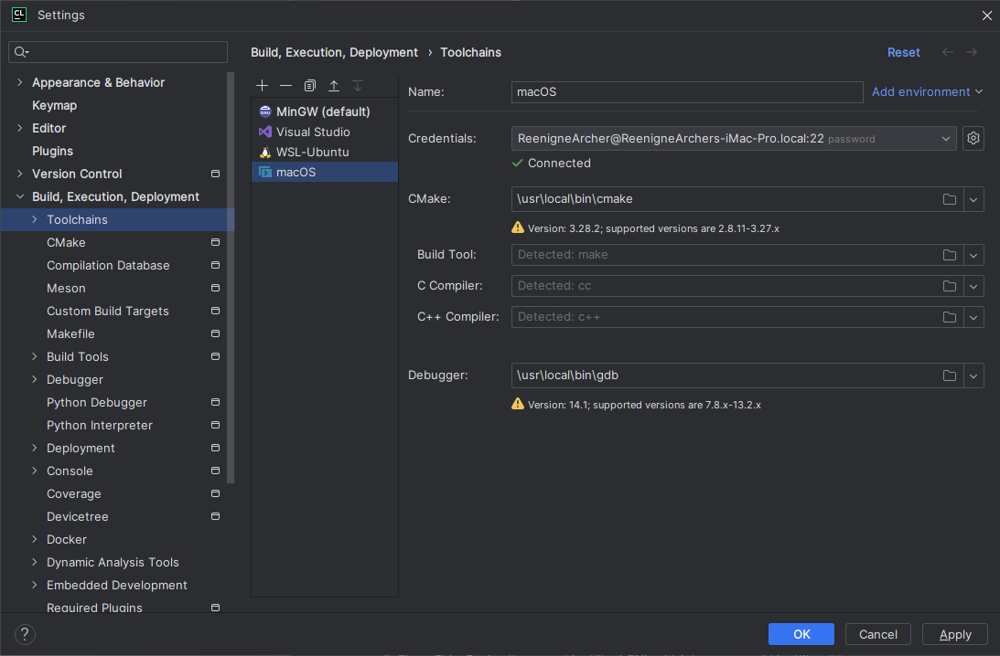
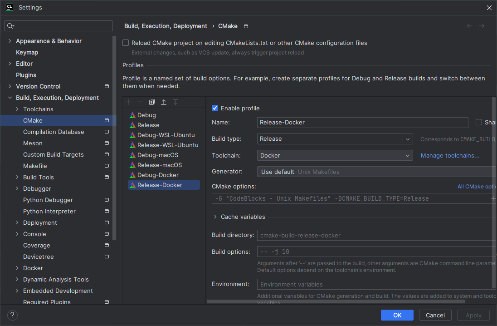

## Introduction
When developing multiplatform C++ projects, it can be frustrating to have to switch between different systems to
develop, inspect, and test your code. This is especially true when you are working on a project that has dependencies.

Without the proper setup, you may find your IDE complaining about missing headers, libraries, etc.


This example shows 975 problems in this single file.

In this post, I will show you how to set up CLion to handle Linux, macOS, and Windows development in a single project,
and from a single system.

## Prerequisites

- CLion
- Method(s) of Virtualization (Docker, WSL, or virtual machine)

## Setting up the remote environment

### Docker

1. Create a `Dockerfile` in your project, ensuring that all the project build dependencies are installed.
   Below is an example.

   ```Dockerfile
   FROM ubuntu:22.04
   
   RUN DEBIAN_FRONTEND="noninteractive" apt-get update && apt-get -y install tzdata
   
   RUN apt-get update \
     && apt-get install -y build-essential \
         gcc \
         g++ \
         gdb \
         clang \
         make \
         ninja-build \
         cmake \
         autoconf \
         automake \
         libtool \
         valgrind \
         locales-all \
         dos2unix \
         rsync \
         tar \
         python \
         python-dev \
     && apt-get clean
   ```

2. Right-click on the `Dockerfile` and select `Modify Run Configuration`.

   

3. Set an image tag and container name. Optionally, enable BuildKit and set a context folder, depending on the content
   of your `Dockerfile`.

4. Right-click on the `Dockerfile` and select `Run '<name of your Dockerfile>'`.

   

### WSL

1. Follow the [how to install Linux on Windows with WSL](https://learn.microsoft.com/en-us/windows/wsl/install)
   instructions.
2. Install the necessary build tools and dependencies according to the Linux distribution you have chosen.

### Virtual machines

Due to the variety of hypervisors available, I will not go into detail on how to set up a virtual machine.
The general idea is to install the OS of your choice, enable SSH, and install the necessary build tools and
dependencies.

Installing Linux and Windows virtual machines is generally straightforward. Installing a macOS virtual machine is
more complicated. Therefore, I've decided to leave a link to the guide I used on how to set it up inside Proxmox.
[installing macos 13 ventura on proxmox](https://www.nicksherlock.com/2022/10/installing-macos-13-ventura-on-proxmox/)

## Setting up CLion

### Add SSH configurations

1. Open CLion and go to `File` -> `Settings` -> `Tools` -> `SSH Configurations`.
2. Click the `+` button and add the SSH configurations for the remote environment(s).

   

### Adding toolchains

1. Open CLion and go to `File` -> `Settings` -> `Build, Execution, Deployment` -> `Toolchains`.
2. Click the `+` button and select the toolchain you want to add.

#### Docker



#### WSL



#### SSH




### Adding CMake profiles

1. Open CLion and go to `File` -> `Settings` -> `Build, Execution, Deployment` -> `CMake`.
2. Click the `+` button and select the CMake profile you want to add.

   

## Update project

The last step is to reload the project.

1. Open the CMake tab and click the reload button.

   

Depending on the project and remote environment(s), this may take some time. However, once it is finished, you should
be able to build, run, and debug your project on all the remote environments simultaneously.


The number of problems detected by CLion was reduced from 975 to 367.

## Conclusion

In this post, I showed you how to set up CLion to handle Linux, macOS, and Windows development in a single project,
all from a single system. Hopefully, this will help you to be more productive and efficient when developing your C++
projects.
